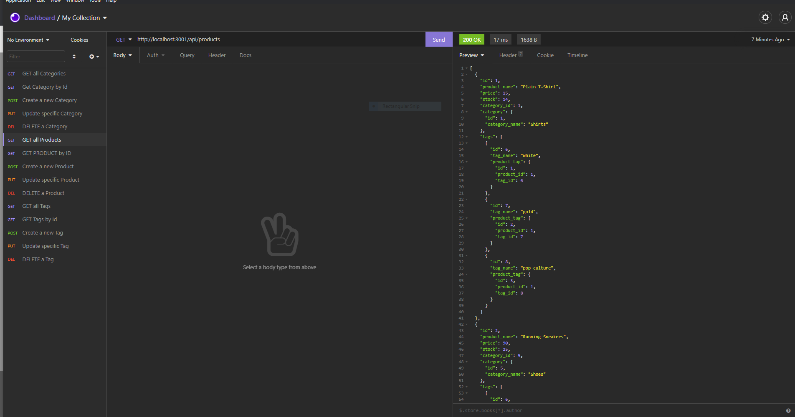
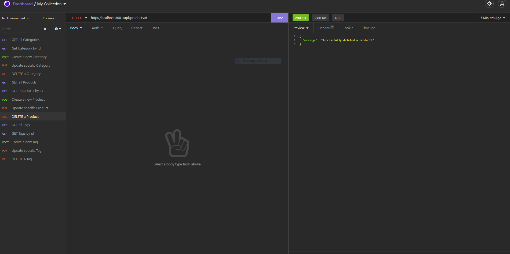

# E-Commerce-Back-End

  ## Description
  o build the back end for an e-commerce site in order to stay competitive with other e-commerce companies
  https://github.com/axmedmohamed7@gmail.com/Ecomers-Back-End
  ## Table of Contents
  * [Installation](#installation)
  * [Usage](#usage)
  * [License](#license)
  * [Tests](#Tests)
  * [Contributions](#Contributions)
  * [Contact](#Contact)
  ## Mock-Up
  
  

  ## Installation 
  Required dependencies to be installed for application functionality: npm i
  ## Usage
  
  ## License
  
  ## Contributions
  
  ## Tests
  For tests use the following commands: npm test
  
  ## Questions?
  Contact me at:
  GitHub: ahmedmh9
  * E-mail: axmedmohamed7@gmail.com
